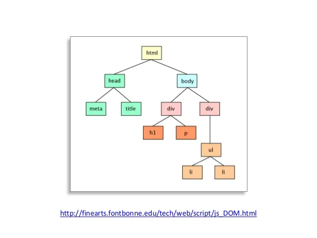

네이버 블로그
https://m.blog.naver.com/magnking/220972680805

MDN
https://developer.mozilla.org/ko/docs/Web/API/Document_Object_Model/Introduction

DOM은 어떻게 생겼나?

## DOM 이란?
### Document Object Model
돔은 메모리에 웹 페이지 문서 구조를 트리구조로 표현해서 웹 브라우저가 HTML페이지를 인식하게 해줌.
웹 페이지의 요소들을 자바스크립트가 이용할 수 있게 브라우저가 트리구조로 만든 객체 모델을 의미함.

## CRP (Critical Rendering Path)
브라우저가 서버에서 페이지에 대한 HTML응답을 받고 화면에 표시하기 전에 여러 단계가 있는데,
웹 브라우저가 HTML문서를 읽고, 스타일을 입힌 후 뷰 포트에 표시하는 과정입니다.