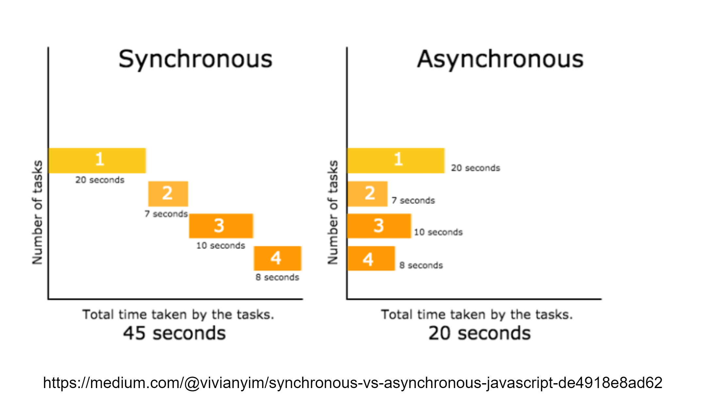
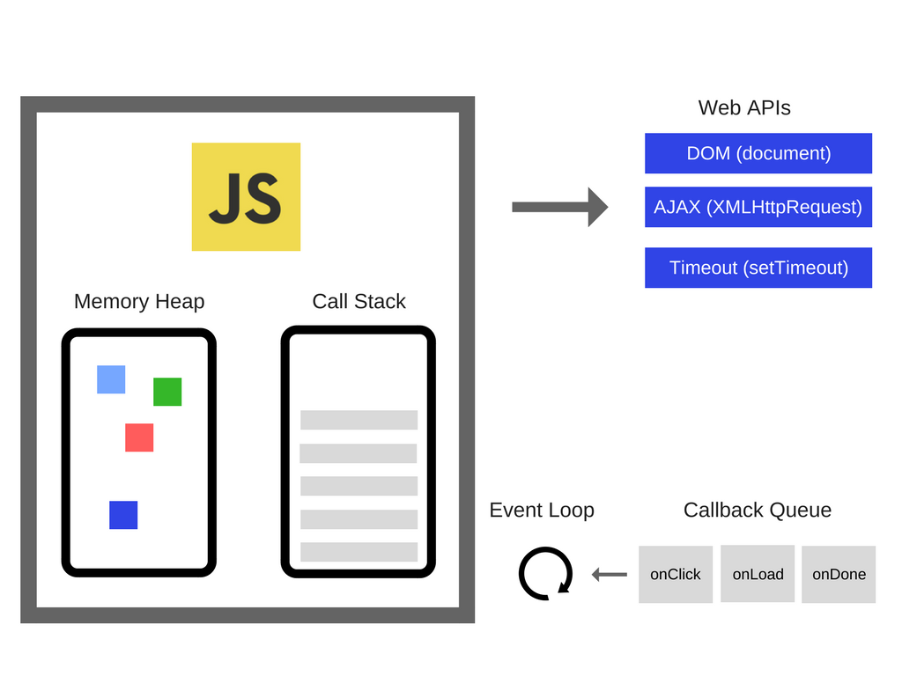

# Event Loop

## 동기 vs 비동기
**setTimeout()**  - 완료된 후 함수나 지정한 코드 조각을 실행하는 타이머 설정

```javascript
console.log('1'); // 동기
setTimeout(() => {
    console.log('2');
}, 3000); // 비동기
console.log('3'); // 동기
```
동기 (Synchronous)
비동기 (Asynchronous)


### Javascript는 동기언어, 비동기코드를 작성하기 위해서 외부의 도움 받음
setTimeout도 자바스크립트가 아니라 브라우저라면 브라우저 api (window object), Node에서 사용한다면 Node api(global object) 사용!
