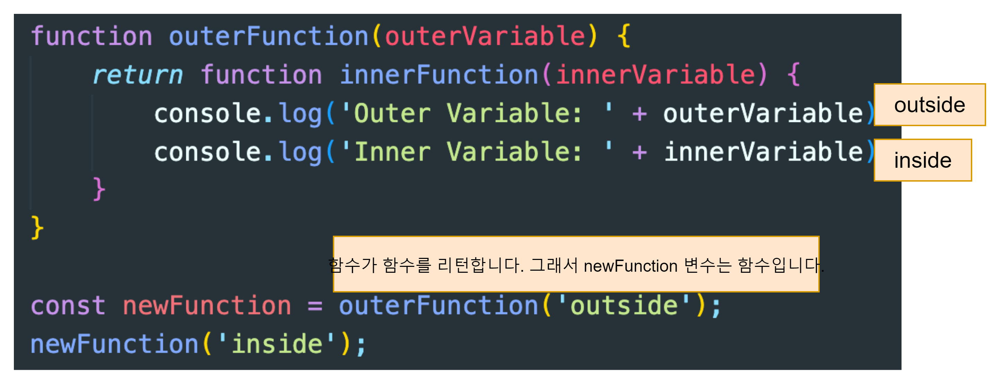

# Closure
클로저(closure)는 함수와 그 함수가 참조하는 주변 상태(렉시컬 환경)를 함께 묶은 것입니다. 즉, 클로저는 내부 함수가 외부 함수의 스코프에 접근할 수 있게 해줍니다. 자바스크립트에서는 함수가 생성될 때마다, 즉 함수 생성 시점마다 클로저가 만들어집니다.

A closure is the combination of a function bundled together (enclosed) with references to its surrounding state (the lexical environment). In other words, a closure gives you access to an outer function's scope from an inner function. In JavaScript, closures are created every time a function is created, at function creation time.

[Closures - MDN](https://developer.mozilla.org/en-US/docs/Web/JavaScript/Closures)


위 그림에서 outerFunction은 한번 call되고 끝남
```javascript
newFunction = function innerFunction
```
인데, innerfunction인 newFunction에서 outerVariable을 사용 가능함.