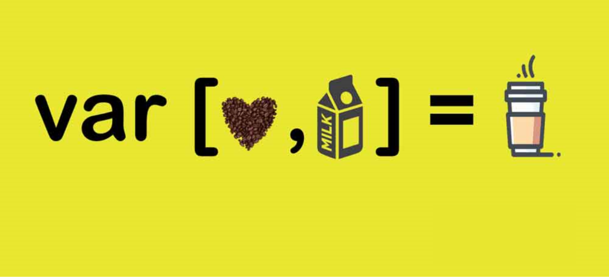

# 구조 분해 할당 (Destructuring Assignment)
**구조 분해 할당** 구문: 배열이나 객체의 속성을 해체하여 그 값을 개별 변수에 담을 수 있게 하는 JavaScript 표현식이다.
이를 잘 이용하면 가독성 좋은 코드를 작성할 수 있다.



```javascript
let a, b, rest;
[a, b] = [10, 20];

console.log(a); // 10
console.log(b); // 20

[a, b, ...rest] = [10, 20, 30, 40, 50];

console.log(rest); // Array [30, 40, 50]
```
<br>

## 배열 구조 분해
#### 기본
```javascript
const week = ['monday', 'tuesday', 'wednesday', 'thursday', 'friday'];
const day1 = week[0];
const day2 = week[1];
const day3 = week[2];
const day4 = week[3];
const day5 = week[4];

대신

const week = ['monday', 'tuesday', 'wednesday', 'thursday', 'friday'];
const [day1, day2, day3, day4, day5] = week;
```
```javascript
var foo = ["one", "two", "three"];

var [red, yellow, green] = foo;
console.log(red); // "one"
console.log(yellow); // "two"
console.log(green); // "three"
```
#### 선언에서 분리된 할당
```javascript
var a, b;

[a, b] = [1, 2];
console.log(a); // 1
console.log(b); // 2
```
#### 기본값
구조분해할당을 할 때, 선언된 값이 undefined인 경우에 대신 사용할 값을 지정해 줄 수 있다.
```javascript
var a, b;

[a = 5, b = 7] = [1];
console.log(a); // 1
console.log(b); // 7
```
#### 변수 값 교환하기 (swap)
보통 변수의 값을 swap하기 위해서는 임시 변수를 지정해서 사용해야 하는데, 이를 이용하지 않고, 하나의 구조 분해 표현식만으로 두 변수의 값을 교환할 수 있다.
```javascript
var a = 1;
var b = 3;

[a, b] = [b, a];
console.log(a); // 3
console.log(b); // 1
```
#### 일부 반환 값 무시하기
```javascript
function f() {
  return [1, 2, 3];
}

var [a, , b] = f();
console.log(a); // 1
console.log(b); // 3
```
<br>

## 객체 구조 분해
#### 기본
```js
var o = { p: 42, q: true };
var { p, q } = o;

console.log(p); // 42
console.log(q); // true
```
#### 선언 없는 할당
객체에서도 선언 없이 구조 분해 할당이 가능하다.
```js
var { p, q } = {p:42, q:true};
```
#### 새로운 변수 이름으로 할당
구조 분해 할당을 하면서, 속성을 해체하여 객체의 원래 속성명과 다른 이름의 변수에 할당할 수 있다.
```js
var o = { p: 42, q: true };
var { p: foo, q: bar } = o;

console.log(foo); // 42
console.log(bar); // true
```

#### 중첩된 객체의 구조분해 할당
```js
let people = [
    {
        name: "Michael Smith",
        family: {
            mother: "Emily Smith",
            father: "John Smith",
            sister: "Mona Smith",
            brother: "Danial Smith"
            },
        age: 35
    },
    {
        name: "Tom Jones",
        family: {
            mother: "Norah Jones",
            father: "Richard Hones",
            brother: "Harry Jones"
        },
        age: 18
    }
];
for (let {name: n, family: {father :f}} of people){
    console.log("Name: " + n + ", Father; "+ f);
}
// Name: Michael Smith, Father; John Smith
// Name: Tom Jones, Father; Richard Hones
```


### 참고 자료
[구조분해할당 - MDN](https://developer.mozilla.org/ko/docs/Web/JavaScript/Reference/Operators/Destructuring_assignment#%EA%B0%9D%EC%B2%B4_%EA%B5%AC%EC%A1%B0_%EB%B6%84%ED%95%B4)