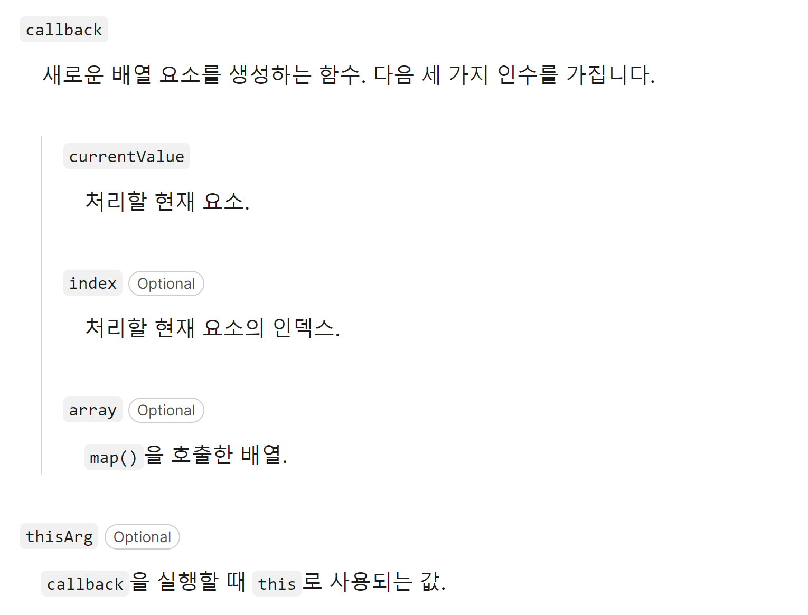

# Map, Filter, Reduce

## Map
map()메서드는 배열 내의 모든 요소 각각에 대해여 주어진 함수를 호출한 결과를 모아 새로운 배열을 반환하는 메서드이다.
```js
const array1 = [1, 4, 9, 16];
const map1 = array1.map((x) => x * 2);

console.log(map1); //Array [2, 8, 18, 32]
```
#### 구문
```js
arr.map(callback(currentValue[, index[, array]])[, thisArg])
```
```js
const arr1 = [1, 2, 3, 4, 5];
const map1 = arr1.map(function(item, index, array) {
    console.log(item, index, array, this); // 1 0 [1, 2, 3, 4, 5] {a: "a"}
    return item * 2;
}, {a: 'a'} );

console.log(map1); // [2, 4, 6, 8, 10]
```
#### 매개변수 정리
{: width="70%"}

#### 객체 재구성 예제
```js
var kvArray = [
  { key: 1, value: 10 },
  { key: 2, value: 20 },
  { key: 3, value: 30 },
];

var reformattedArray = kvArray.map(function (obj) {
  var rObj = {};
  rObj[obj.key] = obj.value;
  return rObj;
});
// reformattedArray는 [{1:10}, {2:20}, {3:30}]

// kvArray는 그대로
// [{key:1, value:10},
//  {key:2, value:20},
//  {key:3, value: 30}]
```
<br>


## Filter
```js
const arr2 = [1, 2, 3, 4, 5];
const filter1 = arr2.filter(function(item, index, array) {
    console.log(item, index, array, this);
    return item > 2;
}, {b: 'b'} );

console.log(filter1); // [3, 4, 5]
```
```js
arr.filter(callback(element[, index[, array]])[, thisArg])
```

## Reduce
```js
const arr3 = [1, 2, 3, 4, 5];
const reduce1 = arr3.reduce(function(accumulator, currentValue, index, array) {
    console.log(accumulator, currentValue, index, array, this); // 0 1 0 [1, 2, 3, 4, 5] {c: "c"}
    return accumulator + item;
}, 0);

console.log(reduce1); // 15
```
```js
reduce(callbackFn)
reduce(callbackFn, initialValue)
```